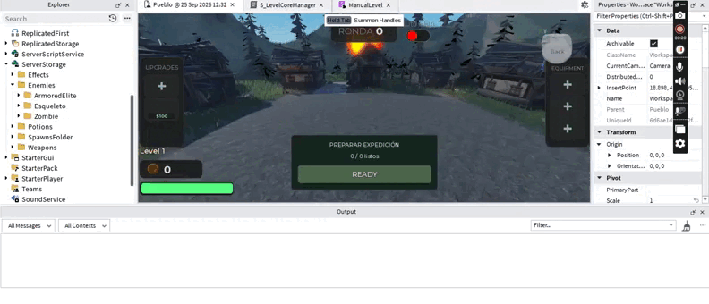
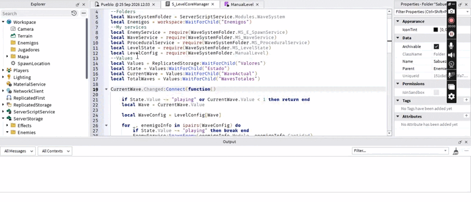

# Waves system Framework

A modular, data-driven wave and match-state framework built in **Luau for Roblox**.

The system is designed so that adding or reconfiguring enemies does not require changing the core spawning or wave logic.

An enemy becomes available to the framework by adding a folder containing its model and configuration values. The catalog reads that folder, registers the enemy metadata, and makes it available to the procedural wave generator.

Procedural generation is also optional: the same spawn service can consume manually-authored wave tables.

> This repository contains the core wave from a rounds game or minigame
---

## Demo

### Data-driven enemy registration and procedural generation



A new enemy can be introduced by adding a configured folder containing its model and values. The framework registers it automatically and makes it available to the procedural generator without requiring changes to the core spawning or wave logic.

Enemy availability is controlled by `UnlockWave`, while `Cost` and `Weight` influence the generated composition of each wave.

### Manual level authoring



The spawn layer is independent from the procedural generator, allowing developers to define their own wave tables and reuse the same enemy spawning pipeline.

**Full demo:** _Add unlisted YouTube link here_

---

## Design Goals

### Configuration over hard-coded behavior

Enemy configuration is stored alongside the enemy model rather than inside the generation code.

Each enemy folder provides values such as:

- `Cost`
- `Weight`
- `UnlockWave`
- `CoinReward`

This keeps the generator generic and makes it possible to rebalance enemies or create different configurations without rewriting the procedural logic.

### Data-driven enemy discovery

`MS_EnemyCatalog` scans the enemy folders stored in `ServerStorage`, reads their configuration values, and builds a metadata registry.

The resulting metadata is cached after the first build so the same enemy definitions do not need to be parsed repeatedly during the server lifetime.

### Procedural generation is optional

The procedural generator produces wave entries in this format:

```luau
{
    model = EnemyModel,
    amount = 5
}
```

`MS_E_SpawnService` only needs a model and an amount. It does not need to know whether that composition came from the procedural generator or from a manually-authored level.

```text
ProceduralService ──┐
                    ├──> EnemyService ──> Spawned enemies
Manual Wave Table ──┘
```

### Separation of responsibilities

Enemy discovery, procedural composition, spawning, wave progression, match state, and orchestration are kept in separate modules.

For a detailed breakdown of those responsibilities and the complete data flow, see [`docs/architecture.md`](docs/architecture.md).

---

## Architecture Overview

```text
                       ┌──────────────────┐
                       │    LevelState    │
                       │ waiting/playing/ │
                       │     finished     │
                       └────────┬─────────┘
                                │
                                ▼
                    ┌──────────────────────┐
                    │  LevelCoreManager    │
                    │     orchestration    │
                    └───────┬───────┬──────┘
                            │       │
                ┌───────────┘       └────────────┐
                ▼                                ▼
       ┌────────────────┐              ┌──────────────────┐
       │  WaveService   │              │ ProceduralService│
       │ wave lifecycle │              │ wave composition │
       └────────────────┘              └────────┬─────────┘
                                                │
                                                ▼
                                      ┌──────────────────┐
                                      │   EnemyCatalog   │
                                      │ metadata registry│
                                      └──────────────────┘

                    LevelCoreManager
                            │
                            ▼
                  ┌───────────────────┐
                  │   EnemyService    │
                  │ spawn + AI start  │
                  └─────────┬─────────┘
                            │
                            ▼
                     Workspace enemies
```

---

## Enemy Folder Format

The expected structure is:

```text
ServerStorage
└── Enemies
    ├── BasicEnemy
    │   ├── EnemyModel
    │   ├── CoinReward
    │   ├── Cost
    │   ├── UnlockWave
    │   └── Weight
    │
    └── HeavyEnemy
        ├── EnemyModel
        ├── CoinReward
        ├── Cost
        ├── UnlockWave
        └── Weight
```

Example configuration:

```text
Cost        = 25
Weight      = 8
UnlockWave  = 4
CoinReward  = 15
```

Once the folder is present before the server builds its catalog, the enemy becomes part of the metadata registry automatically.

---

## Procedural Generation

The current budget formula is:

```text
budget = BaseBudget + (wave × BudgetPerWave)
```

Current defaults:

```luau
BaseBudget = 90
BudgetPerWave = 15
```

The generator:

1. calculates the current wave budget;
2. filters enemies by `UnlockWave`;
3. filters enemies that can still be afforded;
4. selects an enemy using weighted random selection;
5. subtracts its cost from the available budget;
6. repeats until no affordable enemy remains.

The final composition is converted into `{ model, amount }` entries and passed to the spawn layer.

---

## Project Structure

```text
assets/
├── enemy_catalog.gif
└── manual_level.gif

src/
├── MS_E_SpawnService.luau
├── MS_EnemyCatalog.luau
├── MS_LevelState.luau
├── MS_ProceduralService.luau
├── MS_WaveService.luau
└── S_LevelCoreManager.luau

docs/
└── architecture.md

README.md
```

---

## External Dependencies

This repository focuses on the wave and match framework, so some parts of the complete game are intentionally not included.

The current spawn service references:

```text
MS_EnemyIA
```

which is the external enemy-AI module used by the full game.
---

## Author

**José González**  
GitHub: `Jose988194`
