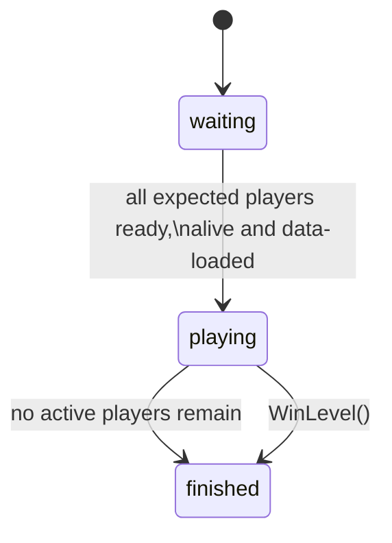

# Architecture

## Overview

The framework separates five concerns:

1. enemy metadata;
2. wave composition;
3. enemy spawning;
4. wave progression;
5. match lifecycle.

`S_LevelCoreManager` connects those systems without containing their internal logic.

---

## Data Flow

```text
ServerStorage.Enemies
        │
        ▼
  EnemyCatalog
        │
        │ metadata
        ▼
ProceduralService
        │
        │ WaveConfig
        ▼
 LevelCoreManager
        │
        │ model + amount
        ▼
   EnemyService
        │
        ├── clone
        ├── position
        ├── tag
        └── start AI
        │
        ▼
 workspace.Enemigos
```

The composition layer and spawn layer are deliberately independent.

```text
Procedural generation ──┐
                        │
Manual wave config ─────┼──> EnemyService ──> Enemy instances
                        │
Other custom system ────┘
```

---

## `MS_EnemyCatalog`

### Responsibility

Build and cache the enemy metadata registry.

### Input

```text
ServerStorage/Enemies/*
```

Each folder contains one enemy model and the configuration values consumed by the system.

### Output

```luau
metadata[model.Name] = {
    modelo = model,
    cost = ...,
    unlockWave = ...,
    weight = ...,
    CoinReward = ...
}
```

### Flow

```text
Enemy folder
    │
    ├── Model
    ├── Cost
    ├── Weight
    ├── UnlockWave
    └── CoinReward
    │
    ▼
Read configuration
    │
    ▼
Validate Cost
    │
    ▼
Register metadata
    │
    ▼
Cache registry
```

Enemy configuration is expected to exist before the server builds the catalog; runtime hot-reloading is outside the current design.

The catalog fails fast when `Cost <= 0`, because a zero-cost enemy would never consume procedural budget.

---

## `MS_ProceduralService`

### Responsibility

Generate a wave composition from the current wave number and enemy metadata.

### Budget

```text
Budget(wave) = BaseBudget + wave × BudgetPerWave
```

Current values:

```text
BaseBudget = 90
BudgetPerWave = 15
```

### Weighted selection

Selection uses a roulette-wheel approach.

For example:

```text
Enemy A = weight 10
Enemy B = weight 5
Enemy C = weight 1
```

The values define relative selection frequency among the currently available enemies.

### Output contract

```luau
{
    model = EnemyModel,
    amount = amount
}
```

This contract is what keeps procedural composition independent from spawning.

---

## `MS_E_SpawnService`

### Responsibility

Instantiate a requested enemy model and activate its AI.

### API

Its public contract is:

```luau
EnemyService:SpawnEnemy(enemy_type, amount)
```

It does not depend on `MS_ProceduralService`.

---

## `MS_WaveService`

### Responsibility

Advance `WaveActual` during an active match.

```text
playing
   │
   ▼
wait until enemies are cleared
OR AutoSkip is enabled
   │
   ▼
3 second delay
   │
   ▼
increment WaveActual
   │
   └──── repeat
```

The `started` flag prevents the wave loop from being started more than once in the same server.

This is intentional because the current game architecture treats one server as one match lifecycle.

---

## `MS_LevelState`

### Responsibility

Track player participation and control match state.

### Match states



### Internal tracking

The module keeps:

```text
Records
Expected
Disconnected
```

Each player record stores:

```text
Player
Ready
Alive
IsParticipant
```

It also mirrors relevant state through attributes:

```text
MatchReady
MatchAlive
MatchParticipant
```

A match starts only when every expected participant is ready, alive, and has loaded their data.

If no active players remain while the match is in `playing`, the match finishes as a defeat.

`WinLevel()` finishes the match as a victory.

---

## `S_LevelCoreManager`

### Responsibility

Coordinate the services.

It listens to `WaveActual`, requests a composition, sends each entry to the spawn service, and resolves the final-wave victory condition.

After the final wave is generated, the manager waits until either the match stops being active or `workspace.Enemigos` becomes empty.

If the match is still in `playing`, it calls:

```luau
LevelState:WinLevel()
```

---

## Manual-Level Extension Point

If you prefer to design and make a manual level, you can skip `MS_ProceduralService` while keeping the same spawn pipeline.

```luau
local ManualLevel = {

    [1] = {
        {model = BasicEnemy, amount = 5,}
        {model = HeavyEnemy, amount = 3}
    }
    [2] = {
        {model = BasicEnemy, amount = 10},
        {model = HeavyEnemy, amount = 3}
    }

}
```

```luau
for _, entry in ManualWave do
    EnemyService:SpawnEnemy(entry.model, entry.amount)
end
```

---

## Current Boundaries

The repository focuses on the wave / match core.

The following systems belong to the complete game but remain outside this repository:

- `MS_EnemyIA`

And a lot of external systems.
